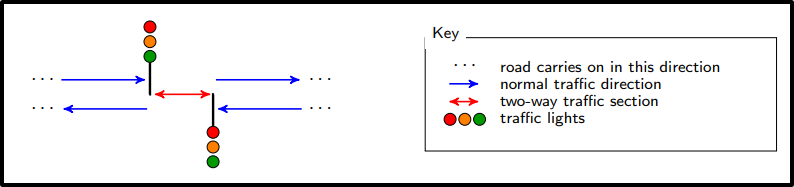
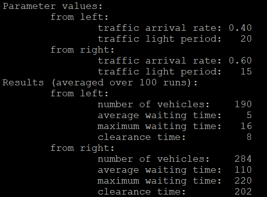

# Traffic-Sim
Traffic simulator is ANSI C based, single lane temporary traffic light simulator. Often two lane (single carriageway) roads can 
have parts closed for construction. In such cases, temporary lights are set to manage the traffic flow through the narrow one lane path.
The aim of this simulator is to determine optimal traffic light time periods in different levels of traffic congestion in those scenarios.

<p align="center">
  </img>
</p>

## Prerequisites
The program was developed in [ANSI C](https://en.wikipedia.org/wiki/ANSI_C) standard, [GCC 4.8.5](https://ftp.gnu.org/gnu/gcc/gcc-4.8.5/) was
used for development. The program was developed in the [Scientific Linux](https://scientificlinux.org/) 7.6.
If to be used in the Windows OS, corresponding project [CMAKE](https://cmake.org/) files should be constructed.

## Getting Started
To compile and link the code call the compileSim script:
```
>> ./compileSim
```

To run the traffic simulator, call the runSimulations executable passing in 
4 parameters in the following order:
- **[leftArrival]** - vehicle arrival rate on the left side of the road
- **[leftLight]** - traffic light period on the left side of the road
- **[rightArrival]** - vehicle arrival rate on the right side of the road
- **[rightLight]** - traffic light period on the right side of the road

An example run would look like:
```
>> ./runSimulations 0.4 20 0.6 15
```

An example corresponding output would be:
<p align="left">
  </img>
</p>

## Details
- Author - Arastun Mammadli
- Completed as part of the [ECM2433](http://emps.exeter.ac.uk/modules/ECM2433) coursework.
- License - [MIT](LICENSE)

